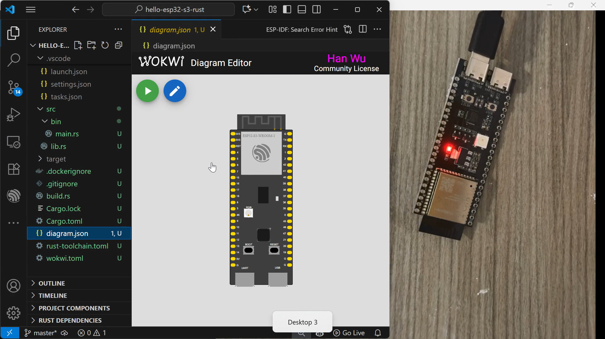

# ESP32-S3 Rust (Xtensa LX7)

The project generated by `esp-generate` uses the serial port to
send `defmt` log messages.

To send log messages via `RTT`, we need to replace the package `esp-println` with `defmt-rtt`.

```bash
# Install toolchain
$ cargo install espup --locked
$ espup install

# Install project generation tool
$ cargo install esp-generate --locked
```


